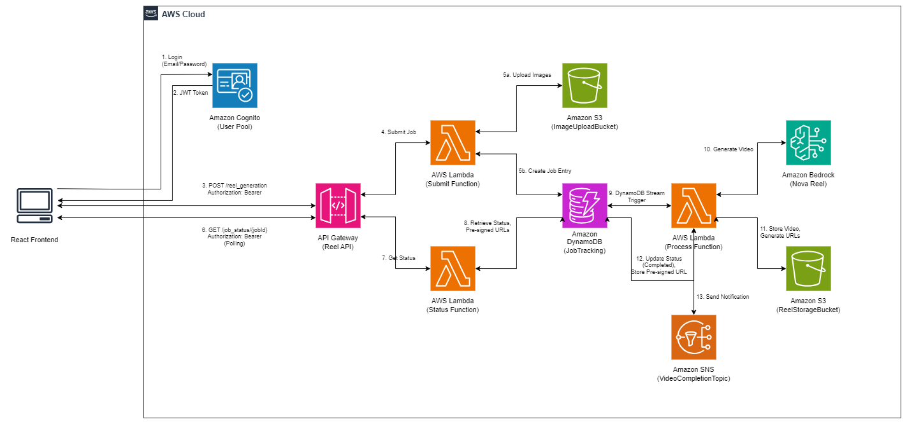

# ContentCraft AI: Serverless AI Content Generation

ContentCraft AI is a serverless application that leverages Amazon Bedrock's Nova models to generate professional video reels from text prompts and optional reference images. It features a **Nova Pro-powered Director Agent** that reasons about your creative goal and autonomously produces a full multi-shot production plan — no prompt engineering required.

<div align="center">
  
  <p><em>ContentCraft AI Serverless Architecture</em></p>
</div>


> **Important:** This application uses various AWS services that may incur costs beyond the Free Tier usage. Please see the [AWS Pricing page](https://aws.amazon.com/pricing/) for details. You are responsible for any AWS costs incurred. No warranty is implied in this example.

## Table of Contents

- [Features](#features)
- [Architecture Overview](#architecture-overview)
- [Project Structure](#project-structure)
- [Prerequisites](#prerequisites)
- [Amazon Bedrock Setup](#amazon-bedrock-setup)
- [Deployment Instructions](#deployment-instructions)
- [How It Works](#how-it-works)
- [API Reference](#api-reference)
- [Testing](#testing)
- [Frontend UI](#frontend-ui)
- [Advanced Usage](#advanced-usage)
- [Troubleshooting](#troubleshooting)
- [Cleanup](#cleanup)
- [Security Considerations](#security-considerations)
- [Resources](#resources)
- [License](#license)

## Features

- **✨ Nova Director Agent (Agentic AI)**:
  - Describe your video idea in plain language
  - Amazon Nova Pro reasons about your goal and autonomously creates a full multi-shot production plan
  - Shows Nova's reasoning, style decisions, and per-shot cinematic prompts
  - Editable plan — review and tweak before generating
  - Powered by `amazon.nova-pro-v1:0` via the Bedrock Converse API

- **Multiple Video Generation Modes**:
  - Single Shot (6s): Quick videos from text prompts with optional image input
  - Automated Multi-Shot (12-120s): Longer videos with automated scene transitions
  - Manual Multi-Shot: Custom videos with precise control over each scene

- **Serverless Architecture**:
  - Fully managed AWS services with automatic scaling
  - Asynchronous processing for long-running video generation
  - Durable storage with versioning support

- **User-Specific Features**:
  - Job listing functionality to view all your submitted jobs
  - HTML email notifications via Amazon SES for job completion
  - User-specific SNS filtering

- **Modern User Interface**:
  - Intuitive React-based web application deployed on AWS Amplify
  - Real-time status updates with auto-polling
  - Embedded video playback with individual shot previews

- **Developer-Friendly**:
  - Infrastructure as Code using AWS CDK
  - Well-documented API endpoints
  - Comprehensive error handling

## Architecture Overview

ContentCraft AI uses the following AWS services:

- **Amazon API Gateway**: RESTful API endpoints for job submission, status checking, job listing, director agent, and email subscriptions
- **AWS Lambda**: Serverless functions for request processing, video generation, job listing, director agent, and email subscriptions
- **Amazon DynamoDB**: NoSQL database for job tracking with TTL support
- **Amazon S3**: Object storage for generated videos and uploaded images
- **Amazon Bedrock (Nova Pro)**: Powers the Director Agent — reasons about creative goals and produces structured shot plans via `amazon.nova-pro-v1:0`
- **Amazon Bedrock (Nova Reel)**: AI video generation using `amazon.nova-reel-v1:1`
- **Amazon SES**: HTML email notifications for job completion
- **Amazon SNS**: Notification topic with user-specific filter policies
- **Amazon Cognito**: User authentication and authorization (admin-created users only)

## Project Structure

```
content-craft/
├── app.py                  # Main CDK application entry point
├── cdk.json                # CDK configuration
├── architecture/           # Architecture diagrams
├── example/                # Example files and templates
├── frontend/               # React-based web UI
├── infrastructure/         # CDK infrastructure code
│   ├── constructs/         # CDK construct modules
│   │   ├── api.py          # API Gateway construct
│   │   ├── auth.py         # Authentication construct
│   │   ├── compute.py      # Lambda functions construct
│   │   ├── email_subscription.py # Email subscription construct
│   │   ├── notifications.py # SNS notifications construct
│   │   └── storage.py      # S3 and DynamoDB construct
│   └── reelcraft_stack.py  # Main CDK stack definition
└── lambda/                 # Lambda function code
    ├── director/           # Nova Director Agent function (NEW)
    ├── list_jobs/          # Job listing function
    ├── process/            # Video processing function
    ├── status/             # Status checking function
    ├── submit/             # Job submission function
    └── subscribe/          # Email subscription function
```

## Prerequisites

Before you begin, ensure you have the following:

- [AWS Account](https://portal.aws.amazon.com/gp/aws/developer/registration/index.html) with appropriate permissions
- [AWS CLI](https://docs.aws.amazon.com/cli/latest/userguide/install-cliv2.html) installed and configured
- [Git](https://git-scm.com/book/en/v2/Getting-Started-Installing-Git) installed
- [AWS Cloud Development Kit (CDK)](https://docs.aws.amazon.com/cdk/v2/guide/getting_started.html) installed
- [Python 3.8+](https://www.python.org/downloads/) installed
- [Amazon Bedrock Nova model access](https://docs.aws.amazon.com/bedrock/latest/userguide/model-access.html#add-model-access) enabled

## Amazon Bedrock Setup

You must request access to the Nova models before using this application:

1. In the AWS console, select your preferred region for Amazon Bedrock.

2. Search for **Amazon Bedrock** in the AWS console.

3. Expand the side menu and select **Model access**.

4. Click the **Edit** button.

5. Enable the following models and accept the EULAs:
   - **amazon.nova-reel-v1:1** — for video generation
   - **amazon.nova-pro-v1:0** — for the Director Agent reasoning

6. Click **Save changes** to activate the models in your account.

## Deployment Instructions

Follow these steps to deploy the application:

### 1. Clone the Repository

```bash
git clone https://github.com/sanjay-chaudhari/content-craft-ai.git
cd content-craft-ai
```

### 2. Set Up Python Environment

```bash
# Create virtual environment
python -m venv .venv

# Activate virtual environment (Windows)
.venv\Scripts\activate.bat

# Activate virtual environment (macOS/Linux)
source .venv/bin/activate

# Install dependencies
pip install -r requirements.txt
```

### 3. Deploy with AWS CDK

```bash
# Bootstrap CDK (first-time only)
cdk bootstrap

# Review CloudFormation template
cdk synth

# Deploy resources
cdk deploy
```

> **Note:** Before deploying, set the `SES_SENDER_EMAIL` environment variable to a verified SES email address in your account:
> ```bash
> export SES_SENDER_EMAIL=your-verified-email@example.com
> cdk deploy
> ```
> This email will be used as the sender for job completion notifications. You can verify an email address in the [SES console](https://console.aws.amazon.com/ses/home#/verified-identities).

### 4. Note the API Endpoint

After deployment completes, note the API Gateway URL from the Outputs section:

```
ContentCraftStack.ApiGatewayEndpoint = https://{id}.execute-api.{region}.amazonaws.com/prod
```

### 5. Create a Cognito User

Self-signup is disabled. Create users via the AWS CLI:

```bash
aws cognito-idp admin-create-user \
  --user-pool-id <user-pool-id> \
  --username <username> \
  --user-attributes Name=email,Value=<email> \
  --temporary-password <temp-password> \
  --region us-east-1
```

The user will be prompted to set a permanent password on first login. The `<user-pool-id>` is available in the CDK deployment outputs.

## How It Works

### Video Generation Workflow

1. **Director Agent (Optional)**:
   - User describes their video idea in plain language
   - Nova Pro (`amazon.nova-pro-v1:0`) reasons about the goal via the Converse API
   - Returns a structured production plan: title, reasoning, style, and per-shot cinematic prompts
   - User reviews and edits the plan, then submits it as a MULTI_SHOT_MANUAL job

2. **Job Submission**:
   - User submits a video generation request via API or UI
   - Request is validated and stored in DynamoDB with SUBMITTED status
   - A unique job ID is returned to the user

3. **Video Processing**:
   - DynamoDB stream triggers the processing Lambda function
   - Job status is updated to PROCESSING
   - Amazon Bedrock Nova Reel (`amazon.nova-reel-v1:1`) generates the video asynchronously
   - Generated video is stored in S3

4. **Status Checking**:
   - User queries job status using the job ID
   - When complete, pre-signed URLs for the video are provided
   - HTML email notification sent via Amazon SES

5. **Email Notifications**:
   - Users subscribe to email notifications via the UI
   - SNS filter policies ensure users only receive their own job notifications
   - Emails are sent as branded HTML via Amazon SES

6. **Job Listing**:
   - Users can list all their submitted jobs
   - Results are filtered by user ID from authentication
   - Job details include status, creation time, and video URLs when available

### Key Components

#### Lambda Functions

- **Director Agent (director.py)** *(New)*:
  - Accepts a plain-language creative goal and optional style hint
  - Calls `amazon.nova-pro-v1:0` via the Bedrock Converse API
  - Returns a structured JSON production plan with title, reasoning, style, and shot prompts
  - Output feeds directly into the MULTI_SHOT_MANUAL submission flow

- **Submit Job (submit.py)**:
  - Validates user input based on task type
  - Creates job records in DynamoDB
  - Processes and stores uploaded images in S3
  - Returns job IDs and initial status to clients

- **Process Job (process.py)**:
  - Processes jobs from DynamoDB streams
  - Configures and calls Amazon Bedrock Nova Reel (`amazon.nova-reel-v1:1`)
  - Monitors async job status
  - Stores generated videos in S3
  - Creates pre-signed URLs for video access
  - Updates job status in DynamoDB
  - Sends SNS notifications on completion with user ID attributes

- **Status Check (status.py)**:
  - Retrieves job information from DynamoDB
  - Formats responses with proper error handling
  - Converts Decimal types to standard JSON types

- **List Jobs (list_jobs.py)**:
  - Retrieves all jobs for the authenticated user
  - Filters results by user ID from authentication context
  - Returns job details in chronological order

- **Subscribe (subscribe.py)**:
  - Subscribes users to the SNS topic for job completion notifications
  - Sets up filter policies based on user ID
  - Manages subscription preferences

#### Infrastructure (CDK)

The `ReelCraftStack` in `reelcraft_stack.py` creates all AWS resources:

- **Auth**: Cognito User Pool and Identity Pool
- **Storage**: DynamoDB table and S3 buckets
- **Compute**: Lambda functions with appropriate permissions
- **API Gateway**: RESTful endpoints with Cognito authorization
- **Notifications**: SNS topic for job completion alerts
- **Email Subscription**: Lambda function for managing user subscriptions

## API Reference

### Director Agent — Generate Production Plan

Uses Nova Pro to reason about a creative goal and return a structured multi-shot plan.

**Endpoint:** `POST /plan`

**Request Body:**

```json
{
  "goal": "A 60-second product promo for an artisan coffee brand, warm rustic feel",
  "style_hint": "cinematic, warm tones"
}
```

**Response (200 OK):**

```json
{
  "title": "Bean to Cup: An Artisan Journey",
  "reasoning": "Opening with the origin establishes authenticity...",
  "total_duration": 36,
  "style": "Warm, cinematic with shallow depth of field",
  "shots": [
    {
      "shot_number": 1,
      "prompt": "Extreme close-up of coffee cherries on a branch...",
      "duration": 6,
      "purpose": "Establish origin and authenticity"
    }
  ]
}
```

---

### Submit Job

Creates a new video generation job.

**Endpoint:** `POST /reel_generation`

**Request Body:**

```json
{
  "task_type": "TEXT_VIDEO",
  "prompt": "Your video description here",
  "image": "base64-encoded-image-data"
}
```

**Alternative Request Bodies:**

```json
{
  "task_type": "MULTI_SHOT_AUTOMATED",
  "prompt": "Your comprehensive video description here",
  "duration": 24
}
```

```json
{
  "task_type": "MULTI_SHOT_MANUAL",
  "shots": [
    {
      "text": "First shot description",
      "image": "base64-encoded-image-data"
    },
    {
      "text": "Second shot description"
    }
  ]
}
```

**Response (202 Accepted):**

```json
{
  "job_id": "uuid-format-id",
  "status": "SUBMITTED",
  "message": "Job submitted successfully"
}
```

### Check Job Status

Retrieves the status of a video generation job.

**Endpoint:** `GET /job_status/{jobId}`

**Response (200 OK):**

```json
{
  "job_id": "uuid-format-id",
  "status": "COMPLETED",
  "prompt": "Original prompt",
  "created_at": 1234567890,
  "video_url": "https://presigned-url-to-video.mp4",
  "shots": [
    {
      "url": "https://presigned-url-to-shot1.mp4",
      "index": 1
    }
  ]
}
```

### List Jobs

Retrieves all jobs for the authenticated user.

**Endpoint:** `GET /jobs`

**Response (200 OK):**

```json
{
  "jobs": [
    {
      "job_id": "uuid-format-id-1",
      "status": "COMPLETED",
      "prompt": "First job prompt",
      "created_at": 1234567890,
      "video_url": "https://presigned-url-to-video.mp4"
    },
    {
      "job_id": "uuid-format-id-2",
      "status": "PROCESSING",
      "prompt": "Second job prompt",
      "created_at": 1234567891
    }
  ]
}
```

### Subscribe to Notifications

Subscribes the user to email notifications for job completions.

**Endpoint:** `POST /subscribe`

**Request Body:**

```json
{
  "email": "user@example.com",
  "subscribe": true
}
```

**Response (200 OK):**

```json
{
  "message": "Successfully subscribed to job completion notifications",
  "subscription_arn": "arn:aws:sns:region:account:topic:subscription-id"
}
```

## Testing

### API Testing with cURL

#### 1. Submit a Single Shot Job

```bash
curl -X POST \
  "https://{api-id}.execute-api.{region}.amazonaws.com/prod/reel_generation" \
  -H "Content-Type: application/json" \
  -H "Authorization: Bearer {id-token}" \
  -d '{
    "task_type": "TEXT_VIDEO",
    "prompt": "A teddy bear in a leather jacket, baseball cap, and sunglasses playing guitar in front of a waterfall."
  }'
```

#### 2. Submit a Multi-Shot Automated Job

```bash
curl -X POST \
  "https://{api-id}.execute-api.{region}.amazonaws.com/prod/reel_generation" \
  -H "Content-Type: application/json" \
  -H "Authorization: Bearer {id-token}" \
  -d '{
    "task_type": "MULTI_SHOT_AUTOMATED",
    "prompt": "Cinematic aerial view of traditional wooden houseboat gliding through serene Kerala backwaters in Alleppey. Golden sunset casts warm light across calm waters, creating mirror-like reflections. Coconut palms line the waterways, swaying gently.",
    "duration": 24
  }'
```

#### 3. Check Job Status

```bash
curl "https://{api-id}.execute-api.{region}.amazonaws.com/prod/job_status/{job_id}" \
  -H "Authorization: Bearer {id-token}"
```

#### 4. List All Jobs

```bash
curl "https://{api-id}.execute-api.{region}.amazonaws.com/prod/jobs" \
  -H "Authorization: Bearer {id-token}"
```

#### 5. Subscribe to Email Notifications

```bash
curl -X POST \
  "https://{api-id}.execute-api.{region}.amazonaws.com/prod/subscribe" \
  -H "Content-Type: application/json" \
  -H "Authorization: Bearer {id-token}" \
  -d '{
    "email": "your-email@example.com",
    "subscribe": true
  }'
```

### Example Prompts

For best results, try these detailed prompts:

1. **TEXT_VIDEO**:
   ```
   The camera pans left across a cozy, well-equipped kitchen, with sunlight streaming through large windows and illuminating the gleaming countertops and appliances. A steam-filled pot bubbles on the stovetop, hinting at the culinary creations to come.
   ```

2. **MULTI_SHOT_AUTOMATED**:
   ```
    Norwegian fjord with still water reflecting mountains in perfect symmetry. Uninhabited wilderness of Giant sequoia forest with sunlight filtering between massive trunks. Sahara desert sand dunes with perfect ripple patterns. Alpine lake with crystal clear water and mountain reflection. Ancient redwood tree with detailed bark texture. Arctic ice cave with blue ice walls and ceiling. Bioluminescent plankton on beach shore at night. Bolivian salt flats with perfect sky reflection. Bamboo forest with tall stalks in filtered light. Cherry blossom grove against blue sky. Lavender field with purple rows to horizon. Autumn forest with red and gold leaves. Tropical coral reef with fish and colorful coral. Antelope Canyon with light beams through narrow passages. Banff lake with turquoise water and mountain backdrop. Joshua Tree desert at sunset with silhouetted trees. Iceland moss- covered lava field. Amazon lily pads with perfect symmetry. Hawaiian volcanic landscape with lava rock. New Zealand glowworm cave with blue ceiling lights. 8K nature photography, professional landscape lighting, no movement transitions, perfect exposure for each environment, natural color grading
   ```

### Viewing Results

After job completion:

1. Navigate to the S3 console
2. Find the bucket with a name like 'apigwlambdabedrockdynamodb-reelvideobucket...'
3. Browse to the folder with your job ID
4. Download and view the generated video files

## Frontend UI

ReelCraft AI includes a modern web interface built with React.

### Setup Instructions

1. Navigate to the frontend directory:
   ```bash
   cd frontend
   ```

2. Install dependencies:
   ```bash
   npm install
   ```

3. Configure environment variables:
   - Copy `.env.example` to `.env` and fill in values from CDK outputs:
   ```bash
   cp .env.example .env
   ```
   ```
   VITE_AWS_REGION=us-east-1
   VITE_COGNITO_USER_POOL_ID=<from cdk output>
   VITE_COGNITO_USER_POOL_CLIENT_ID=<from cdk output>
   VITE_COGNITO_IDENTITY_POOL_ID=<from cdk output>
   VITE_API_ENDPOINT=https://{api-id}.execute-api.{region}.amazonaws.com/prod
   ```
   > **Note:** `.env` is gitignored and must never be committed. Use `.env.example` as a reference template.

4. Start the development server:
   ```bash
   npm run dev
   ```

### UI Features

- **Video Type Selection**: Choose between single shot, automated multi-shot, or manual multi-shot
- **Prompt Input**: Enter detailed descriptions for your videos
- **Image Upload**: Optionally upload images to guide video generation
- **Status Monitoring**: Track job progress in real-time
- **Video Playback**: View completed videos directly in the browser
- **User Authentication**: Secure access with Cognito integration
- **Job History**: View all your previously submitted jobs
- **Email Notifications**: Subscribe to receive alerts when your videos are ready

## Advanced Usage

### Custom Shot Configuration

For manual multi-shot videos, you can precisely control each shot:

1. Select "Manual Multi-Shot" in the UI
2. Specify the number of shots (2-20)
3. For each shot:
   - Provide a detailed text description
   - Optionally upload a reference image
   - Adjust shot parameters as needed

### Image Guidelines

For best results with image inputs:

- Use 1280x720 resolution (16:9 aspect ratio)
- Ensure clear, well-lit images
- Avoid text overlays or watermarks
- Use JPEG or PNG formats


## Troubleshooting

### Common Issues

1. **Model Access Error**:
   - Ensure you've enabled the amazon.nova-reel-v1:1 model in Bedrock
   - Verify your region supports the Nova model

2. **Deployment Failures**:
   - Check IAM permissions for CDK deployment
   - Ensure your AWS CLI is properly configured

3. **Video Generation Timeout**:
   - For complex prompts, generation may take longer
   - Check job status periodically rather than waiting for immediate results

4. **Image Processing Issues**:
   - Verify image is properly base64-encoded
   - Ensure image meets size and format requirements

5. **Email Subscription Issues**:
   - Check your spam folder for confirmation emails
   - Verify the email address is correctly entered
   - Ensure the SNS topic has proper sending permissions

### Logs and Debugging

To view Lambda function logs:

1. Open the AWS CloudWatch console
2. Navigate to Log Groups
3. Find the log group for the relevant Lambda function:
   - `/aws/lambda/ReelCraftStack-SubmitJobFunction-*`
   - `/aws/lambda/ReelCraftStack-ProcessJobFunction-*`
   - `/aws/lambda/ReelCraftStack-CheckJobStatusFunction-*`
   - `/aws/lambda/ReelCraftStack-ListJobsFunction-*`
   - `/aws/lambda/ReelCraftStack-SubscribeEmailFunction-*`

## Cleanup

To avoid ongoing charges, remove all deployed resources:

```bash
# Delete all resources created by CDK
cdk destroy

# Confirm deletion when prompted
```

This will remove:
- Lambda functions
- API Gateway
- DynamoDB table
- S3 buckets and their contents
- SNS topic and subscriptions
- IAM roles and policies
- Cognito User Pool

## Security Considerations

- **Data Privacy**: Videos and prompts are stored in your AWS account
- **Access Control**: Use IAM policies to restrict access to resources
- **Encryption**: S3 buckets use server-side encryption
- **API Security**: API Gateway endpoints are secured with Cognito authentication
- **Content Guidelines**: Follow Amazon Bedrock's usage policies
- **Email Security**: SNS subscriptions require confirmation to prevent spam

## Resources

- [Amazon Bedrock Documentation](https://docs.aws.amazon.com/bedrock/)
- [Bedrock API Reference](https://docs.aws.amazon.com/bedrock/latest/APIReference/welcome.html)
- [AWS CDK Documentation](https://docs.aws.amazon.com/cdk/latest/guide/home.html)
- [React Documentation](https://reactjs.org/docs/getting-started.html)
- [AWS Lambda Best Practices](https://docs.aws.amazon.com/lambda/latest/dg/best-practices.html)
- [Amazon SNS Developer Guide](https://docs.aws.amazon.com/sns/latest/dg/welcome.html)

## License

Copyright 2025 Amazon.com, Inc. or its affiliates. All Rights Reserved.

SPDX-License-Identifier: MIT-0
